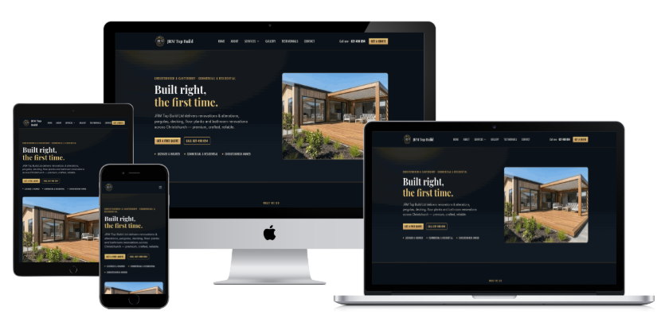

# JRM Top Build Ltd

Marketing site for JRM Top Build Ltd, a Christchurch NZ building company offering renovations & alterations, pergolas, decking, floor planks and bathroom renovations.

**Live site:** [jrmtopbuild.nz](https://jrmtopbuild.nz/)



## Tech stack

**Framework**
- [Next.js 16](https://nextjs.org) (App Router) + React 19 + TypeScript

**Styling & UI**
- [Tailwind CSS v4](https://tailwindcss.com)
- [shadcn](https://ui.shadcn.com) components on [Base UI](https://base-ui.com)
- [lucide-react](https://lucide.dev) icons
- `class-variance-authority` + `tailwind-merge` for component variants
- `next/font` — Playfair Display, Oswald, Inter

**Forms & validation**
- [Zod](https://zod.dev) schema validation
- Next.js Server Actions (the `/contact` quote form)

**Deployment**
- [`@opennextjs/cloudflare`](https://opennext.js.org/cloudflare) + [Wrangler](https://developers.cloudflare.com/workers/wrangler/) — see [Deployment](#deployment) below

## Pages

| Page | URL |
|---|---|
| Home | [/](https://jrmtopbuild.nz/) |
| About | [/about](https://jrmtopbuild.nz/about) |
| Services (hub) | [/services](https://jrmtopbuild.nz/services) |
| — Renovations & Alterations | [/services/renovations-and-alterations](https://jrmtopbuild.nz/services/renovations-and-alterations) |
| — Pergolas | [/services/pergolas](https://jrmtopbuild.nz/services/pergolas) |
| — Decking | [/services/decking](https://jrmtopbuild.nz/services/decking) |
| — Floor Planks | [/services/floor-planks](https://jrmtopbuild.nz/services/floor-planks) |
| — Bathroom Renovations | [/services/bathroom-renovations](https://jrmtopbuild.nz/services/bathroom-renovations) |
| Gallery | [/gallery](https://jrmtopbuild.nz/gallery) |
| Testimonials | [/testimonials](https://jrmtopbuild.nz/testimonials) |
| Service Area | [/service-area](https://jrmtopbuild.nz/service-area) |
| Contact / Get a Quote | [/contact](https://jrmtopbuild.nz/contact) |
| Privacy | [/privacy](https://jrmtopbuild.nz/privacy) |

## Getting started

```bash
npm install
npm run dev
```

Open [http://localhost:3000](http://localhost:3000) to view it.

## Scripts

| Script | Description |
|---|---|
| `npm run dev` | Start the local dev server (Turbopack) |
| `npm run build` | Production build |
| `npm run start` | Run the production build locally |
| `npm run lint` | ESLint |
| `npm run preview` | Build and preview the Cloudflare Worker locally via Wrangler |
| `npm run deploy` | Build and deploy to Cloudflare Workers |
| `npm run upload` | Build and upload a gradual/versioned deployment |
| `npm run cf-typegen` | Generate `cloudflare-env.d.ts` binding types |

## Deployment

The site deploys to [Cloudflare Workers](https://workers.cloudflare.com) via the [`@opennextjs/cloudflare`](https://opennext.js.org/cloudflare) adapter (see `wrangler.jsonc` and `open-next.config.ts`). The repo is Git-connected to Cloudflare for CI deploys on push; `npm run deploy` handles a manual deploy.

## Project structure

- `app/` — routes (App Router)
- `components/` — shared UI, layout, and page-section components
- `lib/` — site content/data (services, gallery, suburbs, testimonials) and the quote-form validation schema

See `CLAUDE.md` for a deeper architecture overview.
